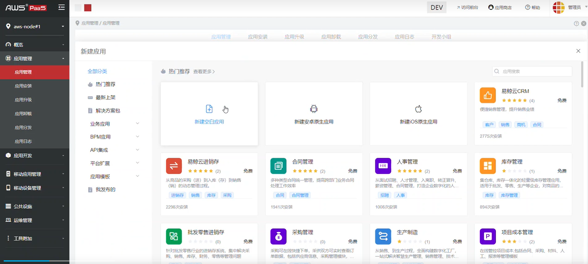
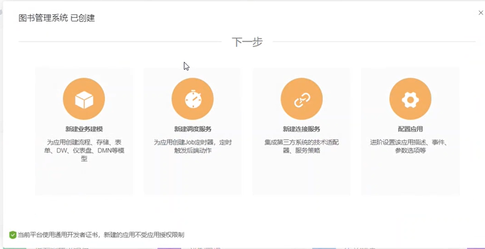
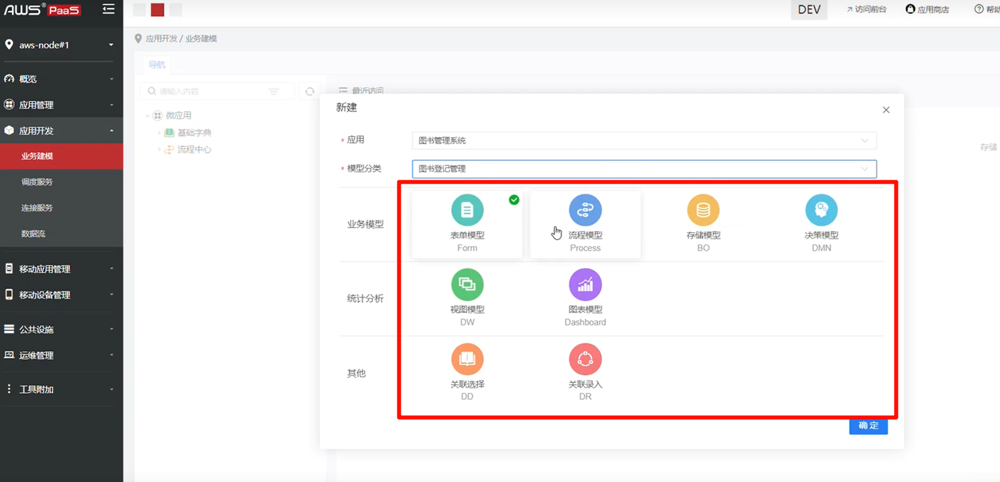
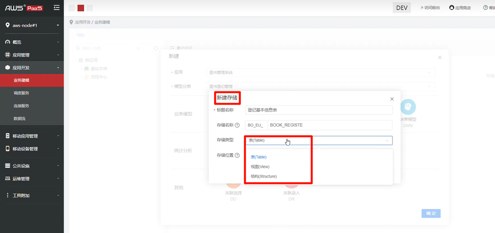
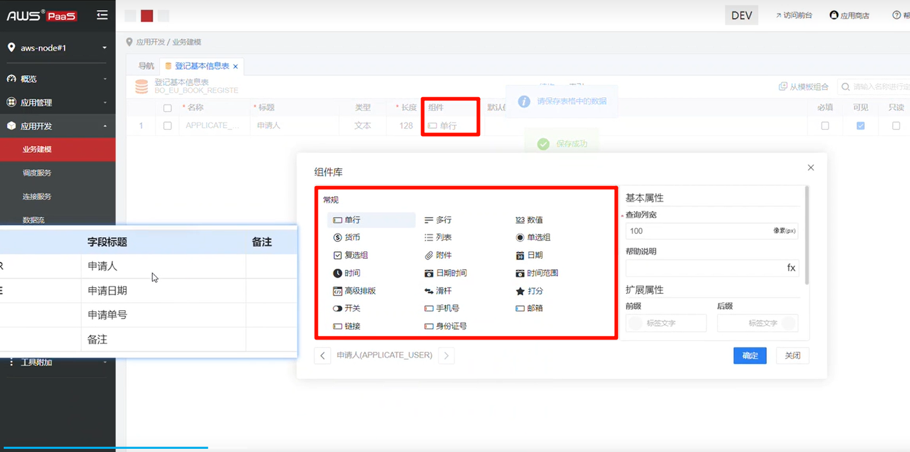
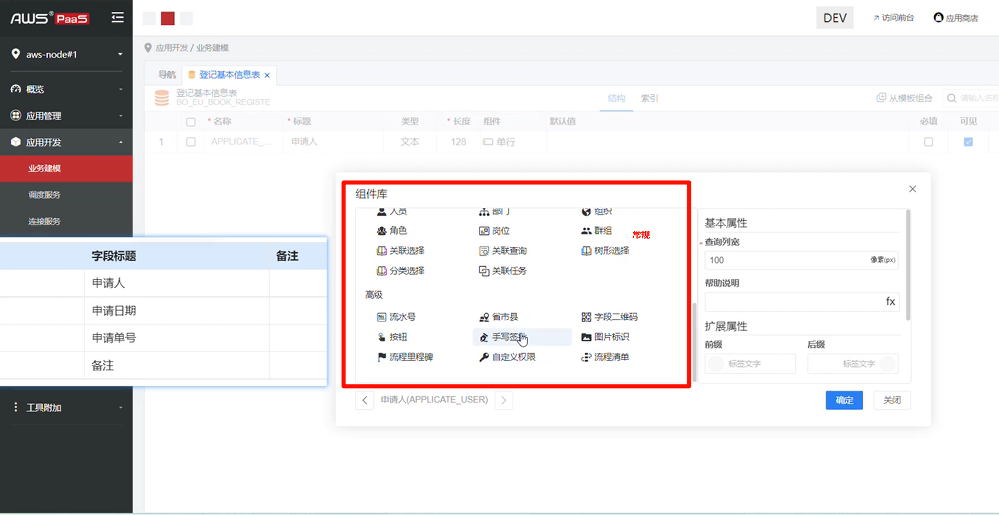
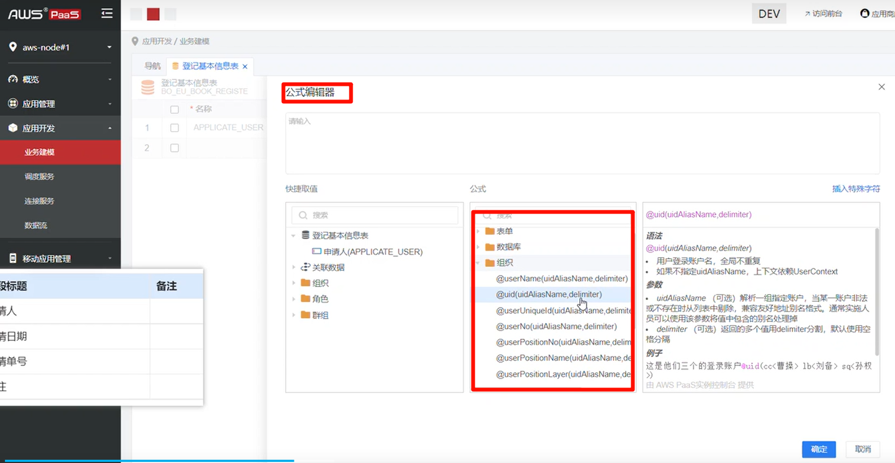

# 开发门户功能模块
> **version 6.4.2.1019**

## 一、应用管理
### 1. 应用管理
- 应用管理：

- 应用创建：

- 业务建模：

- 新建存储：

- 组件库：

- 公式编辑器：

### 2. 应用安装
### 3. 应用升级
### 4. 应用卸载
### 5. 应用分发
### 6. 应用日志

## 二、应用开发
## 三、移动应用管理
## 四、移动设备管理
## 五、公共设施
## 六、运维管理